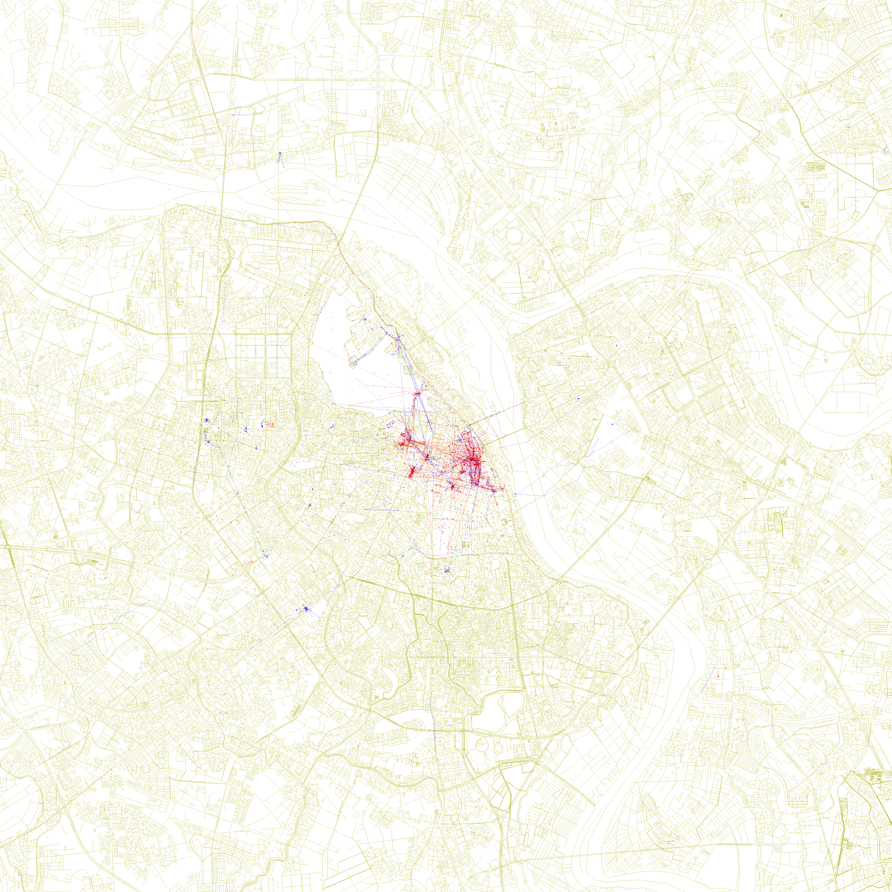

# Locals and Tourists: Hanoi

A reproduction of Erica Fischer's 2010 [*Locals and Tourists*](https://www.flickr.com/photos/walkingsf/albums/72157624209158632/)
map series, built for Hanoi. Fischer computed a bounding box for Hanoi but
never published a map of it.

    blue    locals    photographed in Hanoi over a range of a month or more
    red     tourists  appear to be a local of a different city, here < a month
    yellow  unknown   have not photographed anywhere over a span of a month

*Full resolution, 6137×6137 at 3.95 m/px, the same canvas size as the
originals. Smaller renders are in [`out/`](out/).*

Build:

    .venv/bin/python lat/build_fischer.py --size 6137

## Result

| | photographers classified | with a mark on the map | photos plotted |
|---|---|---|---|
| locals (blue)    | 145 | 140 | 8,812 |
| tourists (red)   | 613 | 530 | 10,258 |
| unknown (yellow) | 202 | 147 | 1,204 |
| total            | 960 | 817 | 20,274 + 2,524 connecting lines |

905 of the 960 classified photographers have at least one photo inside the
drawn box. 55 have none, and the discredited-pin mask described below removes
the last marks of a further 88.

Hanoi reads as tourist-dominated: 64% of classified photographers (613/960) and
51% of plotted photographs (10,258/20,274) are visitors. The blue layer spreads
about twice as wide as the red, with a median distance from Hoàn Kiếm of 2.48 km
against 1.21 km, while red stays packed into the Old Quarter and around the lake.

## Data

The source is [YFCC100M](https://multimediacommons.wordpress.com/yfcc100m-core-dataset/),
the Creative-Commons slice of the same Flickr corpus Fischer worked from. It is
the bulk source we found carrying all four fields the method needs: photographer
id, date taken, longitude, latitude.

    100,000,000 rows scanned          48,469,829 geotagged   (per harvest.status)
    23,775 inside a wide Hanoi box    23,631 kept
    960 photographers, whose worldwide history is 1,114,773 rows pulled
                                               / 1,106,583 kept after date cleaning

Cleaning drops 143 rows dated outside 2003-01-01 to 2015-06-01. The raw data
carries stamps from 1826, 1925, 1950, 1951, 1966, 1980 and 1995–2002, and a
single bogus early date stretches a photographer's span past a month and
mislabels them a local. The window still admits 48 rows predating Flickr's
February 2004 launch. One further photo is dropped because the vision pass
placed it in the Hạ Long / Cát Bà karst, about 150 km away.

The Flickr API was considered and rejected: it needs a key issued only to a
logged-in account.

Wikimedia Commons was rejected here too, on the grounds that it carries no
per-photographer worldwide geotagged history and so cannot support the tourist
test. That turned out to be wrong, and the multi-source work below
overturned it: a per-uploader history is queryable through `allimages` plus
`prop=coordinates`, and harvesting it yielded 124,095 rows over 425 uploaders.
Commons is still not in this map, because this map is the single-source
reproduction; it is in the merged variant. The concentration objection is real
but was never the disqualifier: 17,568 Hanoi files from 432 uploaders with the
top three at 46%, and concentration can be capped.

### What the worldwide history does

| classified from | locals | tourists | unknown |
|---|---|---|---|
| worldwide history + Hanoi rows (used) | 145 | 613 | 202 |
| Hanoi rows only | 145 | 3 | 812 |

610 of 960 labels change. Without the worldwide history the red layer collapses
to three photographers, because almost nothing in a photographer's Hanoi photos
can show they are a local of somewhere else, so everyone not demonstrably a
Hanoi resident falls to "unknown". The three survivors shoot in the far-west
group at 105.51, inside the harvested box but outside the drawn one, so a
qualifying home box exists for them without any history at all.

## Method

### Classification (`lat/classify.py`)

Residency is tested inside 15-mile boxes: Δlat 0.217705°, Δlon scaled by
cos(lat), the shape Fischer used. A photographer is a local of Hanoi if their
photos inside the Hanoi box span 30 days or more. Otherwise they are a tourist
if some 15-mile box that does not overlap Hanoi's box holds photos of theirs
spanning 30 days or more. Otherwise unknown.

The box search enumerates every position that can matter. For a fixed-size box
the unconstrained optimum can always be slid until its bottom edge sits on some
point's latitude and its left edge on some point's longitude. That argument does
not survive the disjointness requirement, because sliding can push a box into
Hanoi's box, and the constrained optimum may instead sit flush against Hanoi's
box with its edges touching no point. Those four flush positions are added
explicitly.

Two earlier versions of this were wrong, both understating the tourist count.
Using the photographer's own photo positions as box centres covers only a subset,
since the best box usually lies between points; that cost 8 labels. Point-edge
alignment alone still missed one photographer whose only qualifying box lies
flush against Hanoi's western edge.

Two further notes, both of which were bugs first:

- A cluster is not a city. An earlier version grouped photos by single-link
  clustering and called each cluster a home city. It over-merged along dense
  corridors, giving a median qualifying cluster 70 km across with 39% wider than
  100 km and one at 2,479 km, and it labelled a few people a local of a
  "different city" that was greater Hanoi. Boxes are compact by construction:
  the greatest pairwise ground distance between a tourist's photos inside their
  maximal-span home box has a median of 16.9 km and a maximum of 33.4 km, over
  the 590 tourists with at least two photos in that box, against the box's own
  constant 34.27 km diagonal.
- Timestamps are converted with an explicit epoch rather than
  `datetime.timestamp()`, which resolves naive datetimes through the machine's
  local zone and made one boundary photographer's label depend on the host
  timezone.

### Rendering (`lat/fischer.py`)

| | |
|---|---|
| canvas | 6137×6137, `#FFFFFF` |
| projection | cylindrical equirectangular, equal ground scale at the box centre |
| bounds | Fischer's own Hanoi box `20.926386 105.728233 21.144091 105.961466`, 24.23 km square, 3.95 m/px |
| basemap | 1 px strokes, `#AAAA00`, one uniform stroke, no fills, water as bare outlines |
| points | 3×3 px opaque squares, `#0000FF` / `#FF0000` / `#FFFF00` |
| lines | 1 px at alpha 0.55, accumulating as 1−(1−α)^n where segments coincide, joining one photographer's consecutive photos ≤ 10 min, ≤ 15,000 ft, ≤ 85 mph apart, both endpoints at geo accuracy ≥ 12 and neither on a shared place pin |
| downscales | box averaging, not Lanczos |

Lines carry 63% of the data ink, 74,783 px against 44,518 for points, so their
opacity matters more than any other style parameter here. It was measured rather
than estimated: for blue over white the red channel is exactly 255(1−α), so an
isolated segment reads its own alpha off a single pixel. [STYLE.md](STYLE.md)
records that measurement, its sensitivity to the pixel mask, and the three wrong
answers that preceded it.

The 15,000 ft and 85 mph caps come from Fischer's 2015 code and are undocumented
for the 2010 series. The accuracy ≥ 12 and place-pin gates are ours. The caps are
loose: 101 segments still exceed 1 km, the longest 4.0 km, and they read as a
faint radial starburst around the centre that the London original does not
obviously show. The longest thin straight line feature measurable there is about
1.07 km, bracketed at 1.2–1.4 km on a gap-closed mask, while
`tools/measure_style.py`'s own thin mask reaches only 0.59 km. Treat the
conclusion, that our chords are several times anything measurable in the
original, as the finding rather than any of those numbers. We kept Fischer's
published cap rather than invent a tighter one, and this is the build's most
likely style deviation.

The basemap is present-day OSM via Overpass, 164,398 ways stroked out of 191,100
candidates. Footway, path, steps, cycleway, bridleway and corridor are excluded
by default, with `--include-paths` to keep them, because modern OSM maps Hanoi's
alleys and footpaths far more exhaustively than the 2010-era basemap this style
was drawn against: 24,655 footways in this extract alone. That is an anachronism
correction and also the build's largest single calibration lever, taking
bare-basemap coverage from 7.96% to 6.99%, of which 6.96% survives in the final
composite. Our basemap ink does land near parity with London's, at a median
1.08× across radially matched rings and ranging 0.80–1.29× ring to ring, but
that is not evidence of style fidelity: basemap ink density is a property of a
city's road network and its OSM vintage, not of a renderer, and two cities 16
years apart have no reason to match.

## Visual geolocation of bad geotags

18.4% of the kept rows, 4,340 of 23,631, carry geo accuracy below 12, meaning
city-level or worse, and photos pile onto repeated coordinates that are Flickr
place-picker pins rather than measured positions. Not all such piles are shared:
of the ten later adjudicated as dumping grounds, six are dominated by one
photographer's mis-tagged batches, and at 105.8519,21.0318 it is 134 of 136
photos from a single account. Masking those is still evidence-based, because the
pass looked at the photographs, but they are one person's habit rather than a pin
many people picked.

A vision pass reads the actual photographs, decides whether each shared
coordinate is a real place or a dumping ground, and relocates what is
identifiable from legible Vietnamese street plates, shop addresses, museum
captions and Chinese-character temple plaques. Place names go through Nominatim
(`lat/geocode.py`); none are asserted from memory. The full accounting:

    41 candidate pin groups (at 4dp)     40 adjudicated     1 not examined
    verdicts: 30 genuine places          10 dumping grounds
    675 photos actually looked at        535 given a place  140 UNIDENTIFIED
    of the 535: 161 below a 0.6 confidence gate
                  6 failed to geocode
                  1 identified outside Hanoi  -> dropped from the dataset
                367 accepted  -> 49 distinct destination coordinates

Most shared pins turned out to be genuine landmarks: Ngọc Sơn Temple, the Temple
of Literature, Hỏa Lò Prison, St Joseph's Cathedral, the Sofitel Metropole, Ho
Chi Minh's Mausoleum, the Vietnam Military History Museum, and Hữu Tiệp Lake with
its B-52 wreck. Flickr's place picker legitimately snaps many photographers to
one point at those, so they were left alone. The clearest dumping ground held 575
photos from 137 photographers pinned to an alley off Phố Kim Mã; its sample
included studio product shots and a scanned advertising flyer.

A photo on a pile adjudicated a dumping ground, which the pass could not then
relocate, has a coordinate known to be wrong, so 1,351 such photos are masked
from the map. They are kept for classification, because a city-level geotag is
still evidence the photographer was in Hanoi. For 44 of them the pass did name a
place, but 42 sat below the confidence gate and 2 could not be geocoded.

`masked_ids.json` holds 1,355 ids, four of which reach nothing at all: one is the
photo identified outside Hanoi, dropped from the dataset rather than masked, and
three were removed by date cleaning. Those four feed no part of the pipeline,
classification included.

The mask is keyed on explicit photo ids, emitted by `lat/apply_vision.py` into
`data/reloc/masked_ids.json`, and that script fails if any adjudicated pile
resolves to no photos. An earlier version keyed it on a coordinate string, and
when the pin identity changed, 8 of the 10 keys silently stopped matching
anything: 333 condemned photos went back onto the map while this file still
claimed they were masked. Ids do not drift.

A shared pin is a coordinate value that repeats, so pin identity is coordinates
occurring 5 or more times, merged where they fall within 5 m of each other, with
the resulting cluster counting as a pin only if it holds 12 or more photos from 3
or more photographers. Both halves of that matter. Exact equality splits one real
pin into five, since the Old Quarter pin is stored as 105.85, 105.849998 and
105.849997 crossed with 21.033333 and 21.0333, five values within 4 m, and it
drops 91 photos out of detection. Rounding to 4 decimals is arbitrary and the pin
count is 5× sensitive to the number of decimals. Letting one-off coordinates join
in lets dense city-centre positions chain into blobs, with 15 m single-link over
every coordinate "finding" 75 pins covering 6,041 photos. The same identity is
used for detection and for masking, and relocation destinations are exempt so the
pipeline cannot discredit coordinates it created itself.

## Layout

    lat/harvest_yfcc.sh     one streaming pass over YFCC100M
    lat/build.py            loading, date cleaning, the worldwide-history join
    lat/classify.py         locals / tourists / unknown
    lat/fischer.py          the 6137px renderer
    lat/build_fischer.py    end-to-end build  <- entry point
    lat/multi.py            multi-source merge (see data/multi/MERGE.md)
    lat/build_multi.py      renders the merged map to out/multi/
    lat/harvest_history.py  backfills per-photographer worldwide history
    lat/proj.py             projections
    lat/relocate_fetch.py   pull pile images, build contact sheets
    lat/pile_sheets.py      per-pile contact sheets for adjudication
    lat/geocode.py          Nominatim lookup with on-disk cache
    lat/apply_vision.py     vision answers -> coordinate overrides
    lat/basemap.py          Overpass -> raster    (earlier density renderer)
    lat/render.py           density/ink renderer  (exploratory, superseded)
    tests/test_classify.py  34 assertions; run with PYTHONPATH=.
    tests/test_multi.py     merge-layer assertions
    tools/measure_style.py  reproduces the style measurements
    geoguessr-prompt.txt    the photo-geolocation protocol the vision pass follows
    data/reloc/             vision JSON, overrides, geocode cache (the contact
                            sheets and thumbnails are local working files,
                            excluded by .gitignore)
    STYLE.md                the style spec, with evidence tiers

`out/stats.json` records the headline counts. `tools/measure_style.py` reproduces
the measurements on our own output, being the accumulation ladder and the
point/line ink split, plus the colour-model check on the shipped 800px reference;
given a path to Fischer's 6137px original it also re-runs the basemap hue ratio,
the isolated-line alpha and the longest-straight-line test. Several other figures
quoted here and in STYLE.md have no shipped implementation and are reported from
this project's style audit: the ring-matched basemap ink ratio, London's
accumulation strata, and the dot-size mode. They are flagged where they appear,
and the mask-sensitive ones carry their spread.

## A multi-source variant

Everything above is the faithful reproduction, built from one source. There is
also an experiment in [`data/multi/MERGE.md`](data/multi/MERGE.md) asking what
the same map looks like when every other reachable source of geotagged
photographs is added. It renders to `out/multi/` and never touches the map
above.

    .venv/bin/python lat/build_multi.py --size 6137 --per-source

Wikimedia Commons and iNaturalist both pass the test that matters, which is not
"has photos of Hanoi" but "has a stable photographer id, a date, a coordinate,
and a queryable worldwide history". Without that history the residency colours
cannot be computed at all, so a source that lacks it adds uncoloured dots to a
map whose only content is the colour. GBIF, Panoramax, Wikidata, OpenAerialMap
and OSM notes fail it, and MERGE.md records the measurement that excluded each.

The merged map holds 42,299 points from 2,584 photographers against this map's
20,274 from 817, and the colour balance inverts: the Flickr slice is 51%
visitor photographs, the merge is 59% local.

That inversion is narrower than it looks, and an audit corrected an earlier
version of this paragraph. It is entirely Wikimedia Commons, whose drawn
points are 83.7% local. Remove Commons and the merge is 46.2% local against
47.2% tourist, which is the visitor-leaning baseline again. iNaturalist is not
more local: at 46.4% it is indistinguishable from Flickr's 46.2%, by
photographer it is the least local of the three at 12.7%, and removing it
raises the merged local share rather than lowering it.

Date coverage explains much of the remainder. Restricting every source to the
years YFCC actually covers gives 50.6% local instead of 59%, cutting the
local-minus-tourist margin from +25.3 points to +8.5. The 30-day span rule pays
for a long baseline, and Commons has one where a corpus ending in 2014 cannot.
So read it as a statement about Commons and about date coverage, not about
Hanoi. MERGE.md carries the per-source table.

Reddit, Instagram, TikTok and X were deliberately not crawled. None exposes a
geotag the photographer attached, and deriving the colour would mean inferring
individual accounts' home cities from their posting history, which is profiling
of private individuals. Every source used here relies on location data the
photographer chose to attach to their own photograph.

## Limitations

- YFCC100M is the Creative-Commons slice of Flickr and stops in 2014, so Hanoi
  here is far sparser than Fischer's London was in the full firehose. The map is
  correspondingly emptier. That is data availability, not styling.
- The marks are fewer than the counts suggest. The 20,274 points occupy only
  5,823 distinct pixel positions, 28.7%, with the rest landing on already-painted
  pixels and the largest single pixel carrying 248 photos. Points are opaque, so
  a pile of 248 draws exactly like one photo. Of the 2,524 lines, 1,818 exceed
  5 px and none are zero-length.
- Relocations concentrate. 367 relocated photos land on 49 coordinates, the top
  five holding 57% and 25 landing on a coordinate of their own. We add no jitter:
  an identification gives landmark-level precision, and spreading the points would
  invent precision we do not have.
- 1 of 41 candidate pin groups was never examined, and the pass saw 675 of the
  2,327 photos sitting on such groups. That group sits at 105.5104, 21.0394,
  outside the drawn box, so it cannot affect the image.
- A box just beyond the drawn box counts as a different city, so someone resident
  2 km outside the Hanoi box comes out red. That follows from Fischer's fixed-box
  scheme but is an edge effect of using one box rather than the global set. Every
  tourist's maximal-span home box centre is at least 29.8 km from the city centre
  and only 1 of 613 is within 60 km, so it is not driving the red layer. A search
  minimising distance rather than maximising span does find month-long qualifying
  boxes about 25 km out, inside Hanoi municipality, for a handful of photographers.
- The recorded home box is neither the nearest nor the longest. The search
  early-returns at the first box reaching 30 days, so `home_box_centre` in the
  reason dict is scan-order dependent and no statistic in this file derives from
  it. The search is also bounded by 5-decimal edge rounding and refuses candidate
  centres above |lat| 85.
- 14 connecting segments have identical timestamps at both ends with real
  separation, up to 27 m. The speed cap treats `dt = 0` as 1 s, which asserts
  1-second timestamp granularity; 27 m/s is physical, so they are kept.
- Line draw order is per class. Coincident same-colour segments accumulate
  correctly, but where two different colours cross, one class is composited after
  the other within a render and that crossing density is not accumulated,
  measured at 3,636 px from the drawing ops. A colour test cannot detect a
  blue/red crossing at all. Points are interleaved across classes and drawn last.
- The line-opacity law is a constant. Sub-unity opacity and accumulation are both
  measured; whether alpha also varies with segment length is not established.
- Present-day OSM against a 2010 original. The extract is stamped 2026-09-10.
- Date-uploaded is discarded at harvest, so date-taken cannot be cross-checked
  against it without re-downloading 15 GiB.
- Undocumented choices: the 30-day threshold, no minimum photo count, the pin
  definition above, and the accuracy ≥ 12 line gate.
- Fischer's one stated cleaning rule is not implemented. Photowalks and automated
  cameras were excluded from the residency computation while still being plotted;
  we do not do this.
- The build drops 23,632 worldwide-history rows that duplicate a Hanoi row, keyed
  on the pre-relocation coordinate at 3 decimals, before classifying. Verified
  label-neutral, but neither the table nor the method section would otherwise
  reveal the step.
- The place-pin line gate barely bites. On the drawn set it identifies 3 shared
  pin coordinates covering 245 photos and removes 22 connecting lines.
- Robustness. Dropping either of a photographer's two extreme dates flips 43 of
  960 labels, 4.5%: 29 tourist to unknown, 10 local to unknown, 4 local to
  tourist. So 14 of the 145 blue labels hinge on one date, and the affected
  photographers account for 1.1% of plotted photos. Scaling the residency box by
  ±25%, both the membership test and the box the disjointness check uses, changes
  4 labels at ×0.75 and 0 at ×1.25; an independent implementation scaling only
  the membership test reports 3 and 5. The figure depends on which half of the
  test you scale, so the operation is stated rather than the number alone.

## Credits and licensing

Erica Fischer's work, which this reimplements:

- [*Locals and Tourists*](https://www.flickr.com/photos/walkingsf/albums/72157624209158632/),
  the map series itself
- [*Locals and Tourists #1 (GTWA #2): London*](https://www.flickr.com/photos/walkingsf/4671589629/),
  the sheet every style measurement here was taken against
- [flickr.com/photos/walkingsf](https://www.flickr.com/photos/walkingsf/), where
  the series was published
- [github.com/e-n-f/bounds](https://github.com/e-n-f/bounds), the precomputed
  city boxes; `flickr-picasa/124` is Hanoi and is used verbatim
- [github.com/e-n-f/datamaps](https://github.com/e-n-f/datamaps), the
  point-rendering tool from the same body of work

The method and the look of these maps are Fischer's. This is a reimplementation,
not an original design.

Other sources:

- Photograph metadata from [YFCC100M](https://multimediacommons.wordpress.com/yfcc100m-core-dataset/).
  Individual photographs are © their photographers under their respective
  Creative Commons licences. This repository stores only metadata; the thumbnails
  and contact sheets fetched for visual geolocation are written to
  `data/reloc/img/`, `piles/` and `sheets/` locally and excluded by `.gitignore`.
- Basemap © OpenStreetMap contributors, ODbL, via the Overpass API.
- Geocoding by Nominatim / OpenStreetMap.
- `data/ref_london.jpg` is a downscale of Fischer's London sheet, © Erica
  Fischer, licensed [CC BY-SA 2.0](https://creativecommons.org/licenses/by-sa/2.0/),
  kept here as a measurement reference. It is not our work. The native 6137×6137
  original that several measurements rely on is not redistributed here; fetch it
  from the [Flickr page](https://www.flickr.com/photos/walkingsf/4671589629/) to
  reproduce those figures.
- `data/` is working data and is not intended for redistribution. It holds 1,819
  Flickr thumbnails and contact sheets built from them, whose individual licences
  and photographer credits this pipeline does not record, since the harvest keeps
  no licence column. All of it is excluded by `.gitignore`.
