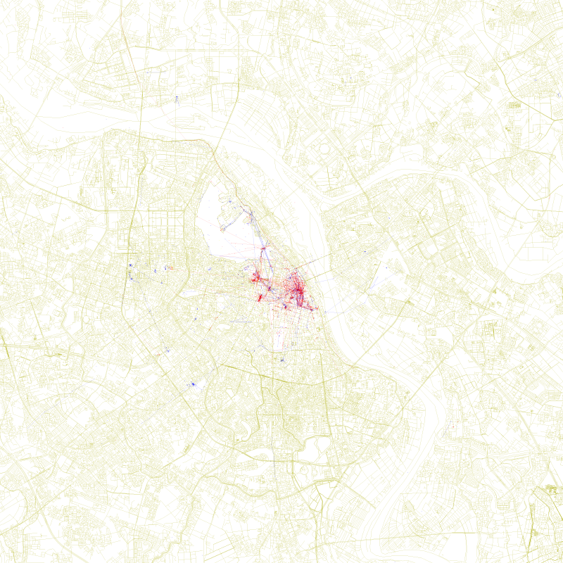

# Locals and Tourists: Hanoi

A reproduction of Eric Fischer's 2010 *Locals and Tourists* map series for
Hanoi — a city he computed a bounding box for but never published a map of.

    blue    locals    photographed in Hanoi over a range of a month or more
    red     tourists  appear to be a local of a different city, here < a month
    yellow  unknown   have not photographed anywhere over a span of a month

Build it with:

    .venv/bin/python lat/build_fischer.py --size 6137

`out/stats.json` records the headline counts. `tools/measure_style.py`
reproduces the measurements on our own output (the accumulation ladder, the
point/line ink split) and the colour-model check on the shipped 800px
reference; given a path to Fischer's 6137px original it also re-runs the
basemap hue ratio, the isolated-line alpha and the longest-straight-line test.
Several other figures quoted here and in STYLE.md — the ring-matched basemap
ink ratio, London's accumulation strata, the dot-size mode — have **no shipped
implementation** and are reported from this project's style audit; they are
flagged where they appear, and the mask-sensitive ones carry their spread.
Fischer's original is his copyrighted image and is not redistributed here.
See [STYLE.md](STYLE.md).

## Result

| | photographers classified | with a mark on the map | photos plotted |
|---|---|---|---|
| locals (blue)    | 145 | 140 | 8,812 |
| tourists (red)   | 613 | 530 | 10,258 |
| unknown (yellow) | 202 | 147 | 1,204 |
| **total**        | **960** | **817** | **20,274** + 2,524 connecting lines |

Of the 960 classified photographers, **905 have at least one photo inside the
drawn box**; 55 have none at all, and the discredited-pin mask (below) removes
the last marks of a further 88, leaving 817 with a mark on the map.

Hanoi comes out tourist-dominated in the photo record: **64% of classified
photographers** (613/960) and **51% of plotted photographs** (10,258/20,274)
are visitors. The blue layer spreads much wider than the red — median distance
from Hoàn Kiếm 2.48 km for locals against 1.21 km for tourists — while red
stays packed into the Old Quarter and around the lake.

## Data

**Source: YFCC100M**, the Yahoo Flickr Creative Commons 100 Million dataset —
the Creative-Commons slice of the same Flickr corpus Fischer worked from, and
the bulk source we could find carrying all four fields the method needs:
photographer id, date taken, longitude, latitude.

    100,000,000 rows scanned          48,469,829 geotagged   (per harvest.status)
    23,775 inside a wide Hanoi box    23,631 kept
    960 photographers, whose worldwide history is 1,114,773 rows pulled
                                               / 1,106,583 kept after date cleaning

The worldwide history is the point: "a local of a *different* city" is
unanswerable from a photographer's Hanoi photos alone.

**Cleaning.** 143 rows carry dates outside 2003-01-01..2015-06-01 and are
dropped — the raw data contains stamps from 1826, 1925, 1950, 1951, 1966, 1980
and 1995–2002, and one bogus early date stretches a photographer's span past a
month and mislabels them a local. The window still admits 48 rows predating
Flickr's Feb-2004 launch. One further photo is dropped because the vision pass
placed it in the Hạ Long / Cát Bà karst, ~150 km away.

**Why not the Flickr API:** it needs a key issued only to a logged-in account.
**Why not Wikimedia Commons:** the disqualifier is that Commons carries no
per-photographer *worldwide* geotagged history, so the tourist test cannot be
run at all. (It is also concentrated — a Commons geosearch not included in this
repo returned 15,431 Hanoi files from 373 uploaders, the top three being 48% —
but concentration could have been capped; the missing history could not.)

## Why the worldwide history is the whole game

| classified from | locals | tourists | unknown |
|---|---|---|---|
| worldwide history + Hanoi rows (used) | 145 | 613 | 202 |
| Hanoi rows only | 145 | **3** | **812** |

610 of 960 labels change. Without the worldwide history the red layer does not
merely shrink, it collapses to three photographers: almost nothing in a
photographer's Hanoi photos can show they are a local of somewhere else, so
everyone who is not demonstrably a Hanoi resident falls to "unknown". (The
three survivors shoot in the far-west group at 105.51, which is inside the
harvested box but outside the drawn one, so a qualifying home box exists for
them without any worldwide history at all.)

## Method

**Classification** (`lat/classify.py`). Residency is tested inside 15-mile
boxes — Δlat 0.217705°, Δlon scaled by cos(lat) — the shape Fischer used. A
photographer is a local of Hanoi if their photos inside his Hanoi box span ≥ 30
days. Otherwise they are a tourist if some 15-mile box **that does not overlap
Hanoi's box** holds photos of theirs spanning ≥ 30 days; otherwise unknown.

The box search enumerates every position that can matter. For a fixed-size box
the *unconstrained* optimum can always be slid until its bottom edge sits on
some point's latitude and its left edge on some point's longitude — but that
argument does not survive the disjointness requirement, because sliding can
push a box into Hanoi's box. The constrained optimum may instead sit flush
against Hanoi's box with its edges touching no point, so those four flush
positions are added explicitly.

Two earlier versions were wrong here, both in the understating direction. Using
the photographer's own photo positions as box *centres* is only a subset (the
best box usually lies between points) and cost 8 labels; point-edge alignment
alone still missed one photographer whose only qualifying box lies flush
against Hanoi's western edge.

Two design notes, both of which were bugs first:

- A cluster is not a city. An earlier version grouped photos by single-link
  clustering and called each cluster a home city; it over-merged along dense
  corridors (median qualifying cluster 70 km across, 39% wider than 100 km, one
  2,479 km) and labelled a few people a local of "a different city" that was
  greater Hanoi. Boxes are compact by construction: taking the greatest
  pairwise ground distance between a tourist's photos inside their
  maximal-span home box, the median is 16.9 km and the maximum 33.4 km (over
  the 590 tourists with at least two photos in that box), against the box's
  own constant 34.27 km diagonal.
- Timestamps are converted with an explicit epoch, not `datetime.timestamp()`,
  which resolves naive datetimes through the machine's local zone and made one
  boundary photographer's label depend on the host timezone.

**Rendering** (`lat/fischer.py`):

| | |
|---|---|
| canvas | 6137×6137, `#FFFFFF` |
| projection | cylindrical equirectangular, equal ground scale at the box centre |
| bounds | his own Hanoi box `20.926386 105.728233 21.144091 105.961466`, 24.23 km square, 3.95 m/px |
| basemap | 1 px strokes, `#AAAA00`, one uniform stroke, no fills, water as bare outlines |
| points | 3×3 px **opaque** squares, `#0000FF` / `#FF0000` / `#FFFF00` |
| lines | 1 px at **alpha 0.55**, accumulating as 1−(1−α)^n where segments coincide, joining one photographer's consecutive photos ≤ 10 min, ≤ 15,000 ft, ≤ 85 mph apart, both endpoints at geo accuracy ≥ 12 and neither on a shared place pin |
| downscales | **box** averaging, not Lanczos |

Lines are 63% of the data ink (74,783 px against 44,518 for points, per
`tools/measure_style.py`), so their
opacity is the single most consequential style parameter here. It was measured
directly rather than estimated: for blue over white the red channel is exactly
255(1−α), so an isolated segment reads its own alpha off one pixel. STYLE.md
records the measurement, its mask sensitivity, and the three wrong answers that
preceded it.

The 15,000 ft and 85 mph caps come from Fischer's 2015 code and are
undocumented for the 2010 series; the accuracy ≥ 12 and place-pin gates are
ours. The caps are loose: 101 segments still exceed 1 km (longest 4.0 km) and
read as a faint radial starburst around the centre, which the London original
does not obviously show — the longest thin straight line feature measurable
there is ~1.07 km, and 1.2–1.4 km is the bracket (measured in this project's
style audit on a gap-closed mask; `tools/measure_style.py`'s own thin mask
reaches only 0.59 km, so treat the conclusion — our chords are several times
anything measurable in the original — as the finding rather than the number).
We kept his
published number rather than invent a tighter one, but this is the build's most
likely style deviation.

**Basemap** is present-day OSM via Overpass: **164,398 ways stroked out of
191,100 candidates**. Footway, path, steps, cycleway, bridleway and corridor
are excluded by default (`--include-paths` to keep them), because modern OSM
maps Hanoi's alleys and footpaths far more exhaustively than the 2010-era
basemap this style was drawn against — 24,655 footways in this extract alone.
That is an anachronism correction, and it is also the build's largest single
calibration lever (bare-basemap coverage 7.96% → 6.99%; 6.96% survives in the
final composite). So: our basemap ink lands near parity with London's — median
1.08× across radially matched rings, ranging 0.80–1.29× ring to ring — and that
is **not** evidence of style fidelity. Basemap ink density is a property of a
city's road network and its OSM vintage, not of a renderer, and two cities 16
years apart have no reason to match.

## Visual geolocation of bad geotags

18.4% of the kept rows (4,340 of 23,631) carry geo accuracy below 12, i.e.
city-level or worse, and photos pile onto repeated coordinates — Flickr
place-picker pins rather than measured positions. Not all of those piles are
*shared*: of the ten later adjudicated as dumping grounds, six are dominated by
a single photographer's mis-tagged batches (at 105.8519,21.0318 it is 134 of
136 photos from one account). Masking those is still evidence-based, because
the pass looked at the photographs — but they are one person's habit, not a
pin many people picked. A
vision pass reads the actual photographs, decides whether each shared
coordinate is a real place or a dumping ground, and relocates what is
identifiable from legible Vietnamese street plates, shop addresses, museum
captions and Chinese-character temple plaques. Place names go through Nominatim
(`lat/geocode.py`); nothing is asserted from memory.

Full accounting, so the yield is not overstated:

    41 candidate pin groups (at 4dp)     40 adjudicated     1 not examined
    verdicts: 30 genuine places          10 dumping grounds
    675 photos actually looked at        535 given a place  140 UNIDENTIFIED
    of the 535: 161 below a 0.6 confidence gate
                  6 failed to geocode
                  1 identified outside Hanoi  -> dropped from the dataset
                367 accepted  -> 49 distinct destination coordinates

Most shared pins turned out to be **genuine landmarks** — Ngọc Sơn Temple, the
Temple of Literature, Hỏa Lò Prison, St Joseph's Cathedral, the Sofitel
Metropole, Ho Chi Minh's Mausoleum, the Vietnam Military History Museum, Hữu
Tiệp Lake with its B-52 wreck — where Flickr's place picker legitimately snaps
many photographers to one point. Those were left alone. The clearest dumping
ground held **575 photos from 137 photographers** pinned to an alley off Phố
Kim Mã; its sample included studio product shots and a scanned advertising
flyer.

A photo on a pile the pass adjudicated a dumping ground, which it could not
then **relocate**, has a coordinate we know to be wrong, so **1,351 such photos
are masked from the map** — they are kept for classification, because a
city-level geotag is still evidence the photographer was in Hanoi. For 44 of
them the pass did name a place, but 42 sat below the confidence gate and 2
could not be geocoded.

`masked_ids.json` holds 1,355 ids, four of which reach nothing at all: one is
the photo identified outside Hanoi, dropped from the dataset rather than
masked, and three were removed by date cleaning. Those four feed no part of the
pipeline, classification included.

The mask is keyed on **explicit photo ids**, emitted by `lat/apply_vision.py`
into `data/reloc/masked_ids.json`, and that script fails if any adjudicated
pile resolves to no photos. An earlier version keyed it on a coordinate string
instead; when the pin identity changed, 8 of the 10 keys silently stopped
matching anything and 333 condemned photos went back onto the map while this
file still claimed they were masked. Ids do not drift.

**What counts as one pin.** A shared pin is a coordinate *value* that repeats,
so pin identity is: coordinates occurring ≥5 times, merged where they fall
within 5 m of each other, with a resulting cluster counting as a pin only if it
holds ≥12 photos from ≥3 photographers. Both halves are load-bearing. Exact equality splits
one real pin into five — the Old Quarter pin is stored as 105.85/105.849998/
105.849997 crossed with 21.033333/21.0333, five values within 4 m — and drops
91 photos out of detection. Rounding to 4 decimals is arbitrary and the pin
count is 5× sensitive to the number of decimals. Letting one-off coordinates
join in lets dense city-centre positions chain into blobs (15 m single-link
over every coordinate "finds" 75 pins covering 6,041 photos). The same identity
is used for detection and for masking, and relocation destinations are exempt
from it so the pipeline cannot discredit coordinates it created itself.

## Layout

    lat/harvest_yfcc.sh     one streaming pass over YFCC100M
    lat/build.py            loading, date cleaning, the worldwide-history join
    lat/classify.py         locals / tourists / unknown
    lat/fischer.py          the 6137px renderer
    lat/build_fischer.py    end-to-end build  <- entry point
    lat/proj.py             projections
    lat/relocate_fetch.py   pull pile images, build contact sheets
    lat/pile_sheets.py      per-pile contact sheets for adjudication
    lat/geocode.py          Nominatim lookup with on-disk cache
    lat/apply_vision.py     vision answers -> coordinate overrides
    lat/basemap.py          Overpass -> raster    (earlier density renderer)
    lat/render.py           density/ink renderer  (exploratory, superseded)
    tests/test_classify.py  34 assertions; run with PYTHONPATH=.
    tools/measure_style.py  reproduces the style measurements
    geoguessr-prompt.txt    the photo-geolocation protocol the vision pass follows
    data/reloc/             vision JSON, overrides, geocode cache (the contact
                            sheets and thumbnails are local working files,
                            excluded by .gitignore)
    STYLE.md                the style spec, with evidence tiers

## Honest limitations

- **Density.** YFCC100M is the Creative-Commons slice of Flickr and stops in
  2014, so Hanoi here is far sparser than Fischer's London was in his firehose.
  The map is correspondingly emptier. That is data availability, not styling.
- **The marks are fewer than the counts suggest.** The 20,274 points occupy
  only **5,823 distinct pixel positions** (28.7%) — the rest land on
  already-painted pixels, and the largest single pixel carries 248 photos.
  Points are opaque, so a pile of 248 draws exactly like one photo. Of the
  2,524 lines, 1,818 exceed 5 px; none are zero-length.
- **Relocations concentrate.** 367 relocated photos land on 49 coordinates, the
  top five holding 57% of them and 25 landing on a coordinate of their own. We
  add no jitter: an identification gives landmark-level precision, and
  spreading the points would invent precision we do not have.
- **1 of 41 candidate pin groups was never examined**, and the pass saw 675 of
  the 2,327 photos sitting on such groups.
- **A box just beyond the drawn box counts as a different city.** Someone
  resident 2 km outside the Hanoi box is "a local of a neighbouring box" and
  comes out red. That follows from Fischer's fixed-box scheme, but it is an
  edge effect of using one box rather than his global set. Measured: every
  tourist's maximal-span home box centre is at least 29.8 km from the city
  centre and only 1 of 613 is within 60 km, so the effect is not driving the
  red layer — but a search that minimises distance rather than maximising span
  does find month-long qualifying boxes ~25 km out, i.e. inside Hanoi
  municipality, for a handful of photographers.
- **The recorded home box is not the nearest or the longest one.** The search
  early-returns at the first box reaching 30 days, so `home_box_centre` in the
  reason dict is scan-order dependent; no statistic in this file is derived
  from it. It is also bounded by 5-decimal edge rounding and refuses candidate
  centres above |lat| 85.
- **14 connecting segments have identical timestamps** at both ends with real
  separation (up to 27 m). The speed cap treats `dt = 0` as 1 s, which asserts
  1-second timestamp granularity; 27 m/s is physical, so they are kept.
- **Line draw order is per class.** Coincident same-colour segments accumulate
  correctly, but where two *different* colours cross, one class is composited
  after the other within a render, and that crossing density is **not**
  accumulated. Measured at 3,636 px (from the drawing ops - a colour test cannot detect a blue/red crossing at all). Points are interleaved across classes and
  drawn last.
- **The line-opacity law is a constant.** Sub-unity opacity and accumulation are
  both measured; whether alpha also varies with segment length is not
  established.
- **Present-day OSM against a 2010 original.** The extract is stamped
  2026-09-10.
- **Date-uploaded is discarded at harvest**, so date-taken cannot be
  cross-checked against it without re-downloading 15 GiB.
- **Undocumented choices:** the 30-day threshold, no minimum photo count, the
  pin definition above, and the accuracy ≥ 12 line gate.
- **Fischer's one stated cleaning rule is not implemented.** He excluded
  photowalks and automated cameras from the residency computation while still
  plotting them; we do not.
- **The build silently drops 23,632 worldwide-history rows** that duplicate a
  Hanoi row, keyed on the pre-relocation coordinate at 3 decimals, before
  classifying. Verified label-neutral, but it is a step neither the table nor
  the method section would otherwise reveal.
- **The place-pin line gate barely bites.** On the drawn set it identifies only
  3 shared pin coordinates (245 photos) and removes 22 connecting lines.
- **The unexamined pile group is harmless**: the one candidate group nobody
  looked at sits at 105.5104, 21.0394 — outside the drawn box — so it cannot
  affect the image.
- **Robustness, measured under the current rule.** Dropping either of a
  photographer's two extreme dates flips **43 of 960 labels (4.5%)**: 29
  tourist→unknown, 10 local→unknown, 4 local→tourist. So **14 of the 145 blue
  labels hinge on one date**; the affected photographers account for 1.1% of
  plotted photos. Scaling the residency box by ±25% — both the membership test and the box the
  disjointness check uses — changes **4 labels at ×0.75 and 0 at ×1.25**; an
  independent implementation that scales only the membership test reports 3 and
  5. Either reading is a handful out of 960, but the figure depends on which
  half of the test you scale, so the operation is stated rather than the
  number alone.

## Credits and licensing

- Photograph metadata: **YFCC100M** (Yahoo Flickr Creative Commons 100M);
  individual photographs are © their photographers under their respective
  Creative Commons licences. This repository stores only metadata; the
  thumbnails and contact sheets fetched for visual geolocation are written to
  `data/reloc/img/`, `piles/` and `sheets/` locally and are excluded by
  `.gitignore`.
- Basemap: **© OpenStreetMap contributors**, ODbL, via the Overpass API.
- Geocoding: **Nominatim / OpenStreetMap**.
- City bounds: **Eric Fischer**, [github.com/e-n-f/bounds](https://github.com/e-n-f/bounds),
  `flickr-picasa/124`.
- `data/ref_london.jpg` is a downscale of Eric Fischer's *Locals and Tourists
  #1 (GTWA #2): London*, © Eric Fischer, licensed **CC BY-SA 2.0**, retained
  here solely as a measurement reference. It is not our work. The native
  6137×6137 original that several measurements rely on is **not** redistributed
  here; fetch it from the author's Flickr page to reproduce those figures.
- `data/` is working data and is **not** intended for redistribution: it holds
  1,819 Flickr thumbnails, and contact sheets built from them, whose individual
  licences and photographer credits this pipeline does not record (the harvest
  keeps no licence column). All of it is excluded by `.gitignore`.
- The method and the look of these maps are Fischer's. This is a
  reimplementation, not an original design.
